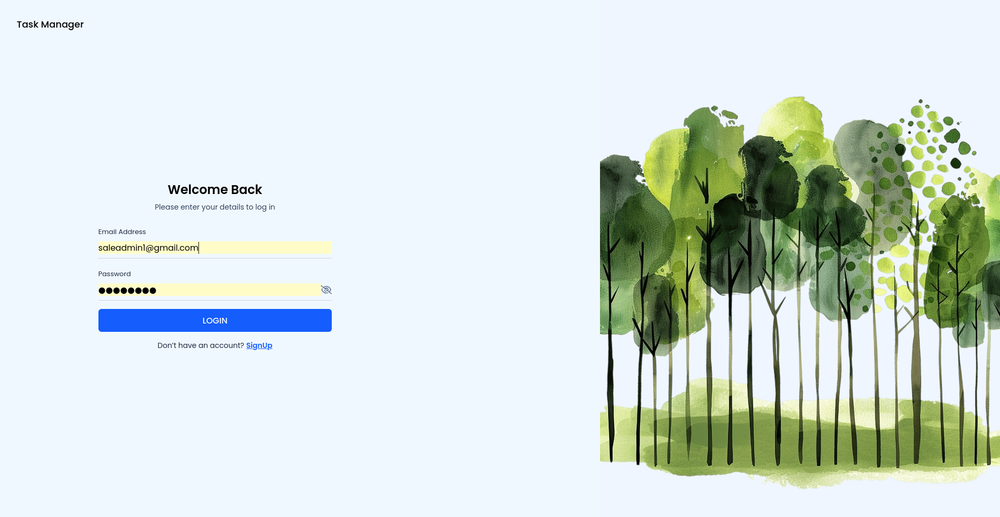
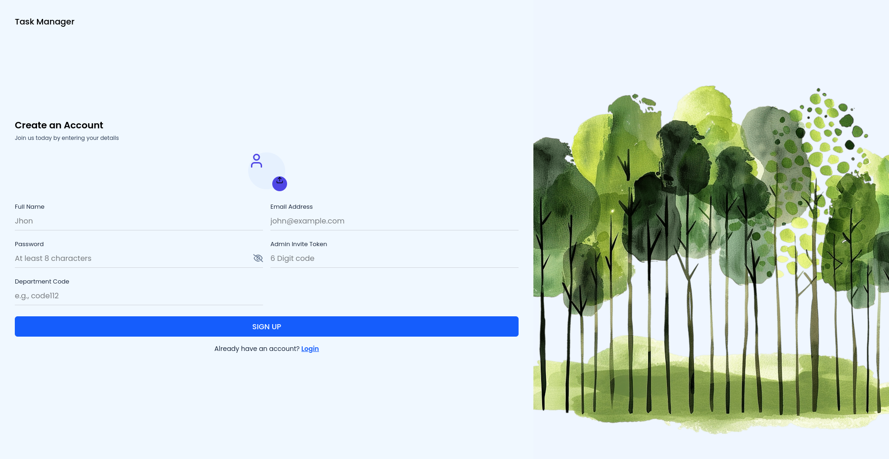
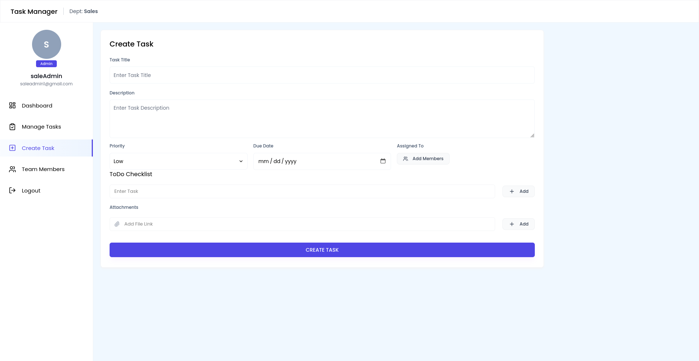
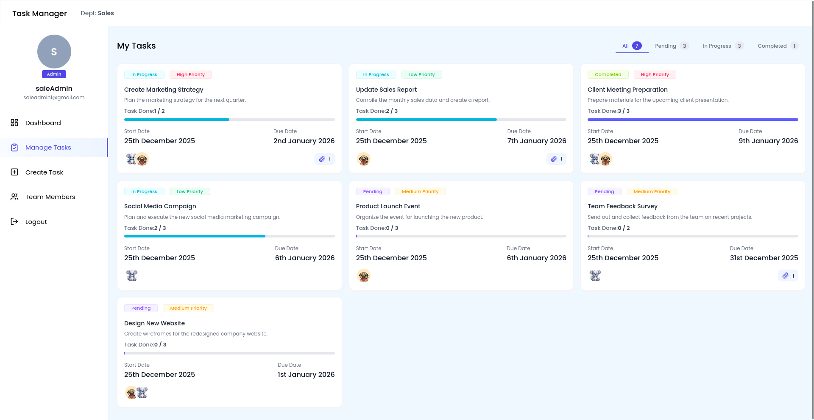
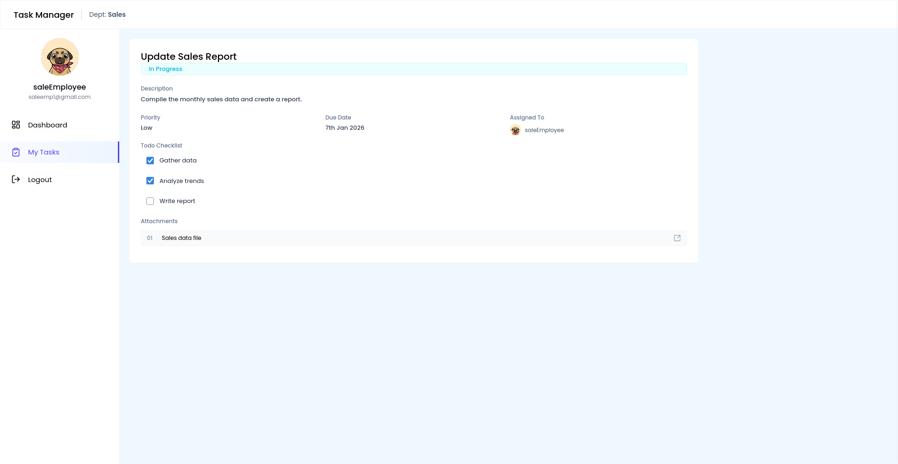
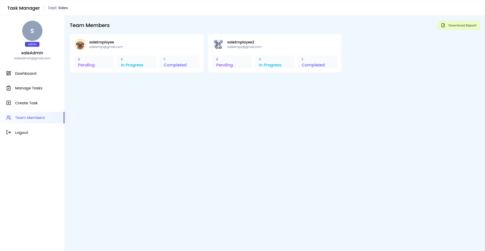
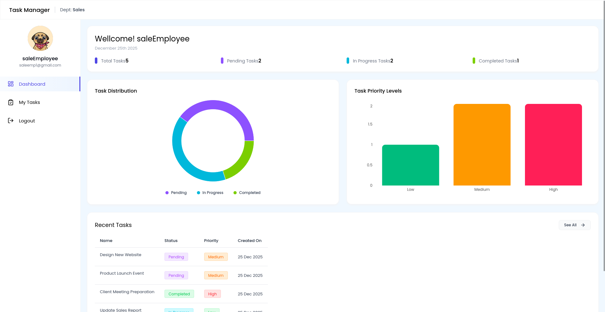
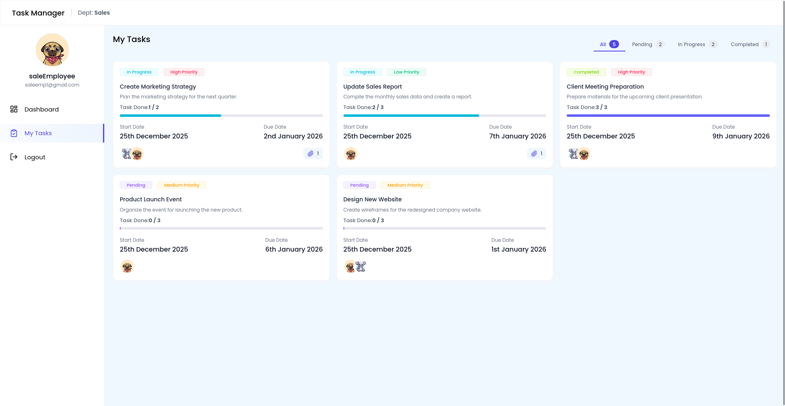

# Task Manager

A full-stack task management application with **department-based access control** and role-based permissions (Admin/Member). Built with React, Node.js, Express, and MongoDB.


## Screenshots

### Authentication

| Login                           | Sign Up                            |
| ------------------------------- | ---------------------------------- |
|  |  |

### Admin Dashboard


### Task Management

| Create Task                                 | Manage Tasks                                  |
| ------------------------------------------- | --------------------------------------------- |
|  |  |

### Task Details



### User Management



### User Dashboard



### My Tasks (Member View)



---

## Features

### Authentication & Authorization

- JWT-based authentication with 7-day token expiry
- Role-based access control (Admin / Member)
- Department-based data isolation (Sales, Marketing, Advertising, HR)
- Admin invite token for privileged registration
- Profile photo upload support

### Task Management

- Create, update, and delete tasks with priority levels (Low, Medium, High)
- Assign tasks to multiple users within the same department
- Track task status: **Pending** → **In Progress** → **Completed**
- Todo checklist with automatic progress calculation
- File attachments support
- Due date tracking with overdue detection
- Department-scoped task visibility

### User Management (Admin)

- View and manage all department users
- User creation and deletion
- Profile management with photo upload

### Dashboard & Analytics

- Real-time task statistics (Total, Pending, In Progress, Completed, Overdue)
- Interactive **Pie Chart** for task distribution by status
- **Bar Chart** for task priority distribution
- Recent tasks overview
- Department-specific analytics

### Reports & Export

- Export all tasks to Excel (.xlsx)
- Export user-task summary report
- Formatted spreadsheets with ExcelJS

## Tech Stack

### Frontend

| Technology       | Version | Purpose                 |
| ---------------- | ------- | ----------------------- |
| React            | 19.1.0  | UI Framework            |
| Vite             | Latest  | Build Tool & Dev Server |
| TailwindCSS      | 4.1.10  | Styling                 |
| React Router DOM | 7.6.2   | Client-side Routing     |
| Axios            | 1.10.0  | HTTP Client             |
| Recharts         | 2.15.3  | Data Visualization      |
| React Hot Toast  | 2.5.2   | Notifications           |
| Moment.js        | 2.30.1  | Date Formatting         |

### Backend

| Technology | Version | Purpose          |
| ---------- | ------- | ---------------- |
| Node.js    | -       | Runtime          |
| Express    | 5.1.0   | Web Framework    |
| MongoDB    | 7.0.0   | Database         |
| Mongoose   | 8.16.0  | ODM              |
| JWT        | 9.0.2   | Authentication   |
| Bcrypt.js  | 3.0.2   | Password Hashing |
| Multer     | 2.0.1   | File Uploads     |
| ExcelJS    | 4.4.0   | Excel Generation |

## Project Structure

```
Task-Manager/
├── backend/
│   ├── config/
│   │   └── db.js              # MongoDB connection
│   ├── controller/
│   │   ├── authController.js  # Auth logic
│   │   ├── taskController.js  # Task CRUD + dashboard
│   │   ├── userController.js  # User management
│   │   └── reportController.js # Excel exports
│   ├── middlewares/
│   │   ├── authMiddleware.js  # JWT verification
│   │   └── uploadMiddleware.js # Multer config
│   ├── models/
│   │   ├── User.js            # User schema
│   │   └── Tasks.js           # Task schema with todos
│   ├── routes/
│   │   ├── authRoutes.js
│   │   ├── taskRoutes.js
│   │   ├── userRoutes.js
│   │   └── reportRoutes.js
│   ├── uploads/               # Uploaded files
│   ├── .env                   # Environment variables
│   ├── .gitignore
│   ├── package.json
│   └── server.js              # Entry point
│
└── frontend/Task-Manager/
    └── src/
        ├── components/
        │   ├── Cards/         # InfoCard, TaskCard, UserCard
        │   ├── Charts/        # PieChart, BarChart
        │   ├── Inputs/        # Form components
        │   └── layouts/       # DashboardLayout, Navbar, SideMenu
        ├── context/
        │   └── userContext.jsx # Auth state management
        ├── hooks/
        │   └── useUserAuth.jsx # Auth hook
        ├── pages/
        │   ├── Admin/         # Dashboard, ManageTasks, CreateTask, ManageUsers
        │   ├── Auth/          # Login, SignUp
        │   └── User/          # UserDashboard, MyTasks, ViewTaskDetails
        ├── routes/
        │   └── PrivateRoute.jsx # Route protection
        ├── utils/
        │   ├── apiPaths.js    # API endpoints
        │   ├── axiosInstance.js # HTTP client config
        │   └── helper.js      # Utility functions
        └── App.jsx            # Root component
```

## Getting Started

### Prerequisites

- Node.js v18+
- MongoDB (local or Atlas)
- npm or yarn

### Installation

**1. Clone the repository**

```bash
git clone https://github.com/Prabesh-Pandey/Task-Manager.git
cd Task-Manager
```

**2. Setup Backend**

```bash
cd backend
npm install
```

**3. Setup Frontend**

```bash
cd ../frontend/Task-Manager
npm install
```

### Running the Application

**Terminal 1 - Backend:**

```bash
cd backend
npm run dev    # Development (with nodemon)
```

**Terminal 2 - Frontend:**

```bash
cd frontend/Task-Manager
npm run dev
```

**Access the app:**

- Frontend: http://localhost:5173
- Backend API: http://localhost:8000

## API Endpoints

### Authentication

| Method | Endpoint             | Description    | Access  |
| ------ | -------------------- | -------------- | ------- |
| POST   | `/api/auth/register` | Register user  | Public  |
| POST   | `/api/auth/login`    | Login          | Public  |
| GET    | `/api/auth/profile`  | Get profile    | Private |
| PUT    | `/api/auth/profile`  | Update profile | Private |

### Tasks

| Method | Endpoint                         | Description                      | Access  |
| ------ | -------------------------------- | -------------------------------- | ------- |
| GET    | `/api/tasks`                     | Get all tasks (filtered by dept) | Private |
| GET    | `/api/tasks/:id`                 | Get task by ID                   | Private |
| POST   | `/api/tasks`                     | Create task                      | Admin   |
| PUT    | `/api/tasks/:id`                 | Update task                      | Admin   |
| DELETE | `/api/tasks/:id`                 | Delete task                      | Admin   |
| PUT    | `/api/tasks/:id/status`          | Update status                    | Private |
| PUT    | `/api/tasks/:id/todo`            | Update checklist                 | Private |
| GET    | `/api/tasks/dashboard-data`      | Admin dashboard stats            | Admin   |
| GET    | `/api/tasks/user-dashboard-data` | User dashboard stats             | Private |

### Users

| Method | Endpoint         | Description    | Access  |
| ------ | ---------------- | -------------- | ------- |
| GET    | `/api/users`     | Get all users  | Admin   |
| GET    | `/api/users/:id` | Get user by ID | Private |
| DELETE | `/api/users/:id` | Delete user    | Admin   |

### Reports

| Method | Endpoint                    | Description         | Access |
| ------ | --------------------------- | ------------------- | ------ |
| GET    | `/api/reports/export/tasks` | Export tasks Excel  | Admin  |
| GET    | `/api/reports/export/users` | Export users report | Admin  |

## User Roles

### Admin

- Full task CRUD operations
- Manage users in department
- View all department tasks
- Access dashboard analytics
- Export reports to Excel

### Member

- View assigned tasks only
- Update task status
- Manage todo checklists
- View personal dashboard
- Cannot create/delete tasks
- Cannot manage users

## Department Isolation

Tasks and users are isolated by department:

- Users can only see tasks from their department
- Admins can only assign tasks to users in their department
- Dashboard shows department-specific statistics

---

Made by Prabesh Pandey
